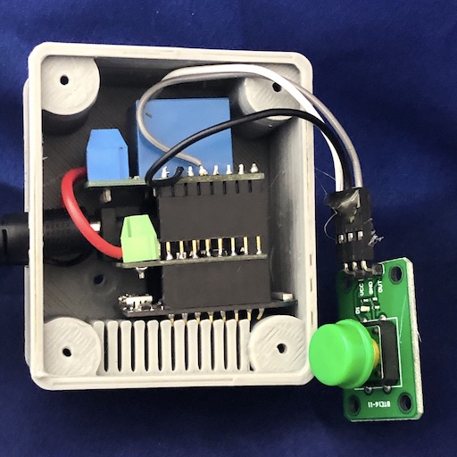

# stacx - Smart-building solutions with ESP8266 and LOLIN stacking modules

Stacx is software for creating smart-building solutions using the
Arduino environment.  It is designed to complement the [LOLIN D1 Mini](https://www.wemos.cc/)
stacking module ecosystem.

Stacx was created because at [Accelerando](https://accelerando.com.au) we found ourselves writing
the same support code over and over again when building  WiFi-enabled smart
building devices.



**image: A simple IoT module consisting of WiFi MCU, power regulator, relay and pushbutton**

We have found that so many off-the-shelf IoT devices are reliant on
closed-platform applications, insecure, or otherwise unsuitable; so we
undertook to create our own open platform focusing on interoperability
and maintainability.  This means you can have one app of your choosing
to control your smart home, not 30 different apps for each device.

The devices we have been creating include:

* Temperature and humidity sensors
* Motion sensors
* Door-lock actuators
* Keypad and proximity-card entry stations
* Egress buttons
* Light controllers
* Programmable LED string controllers
* Door contact sensors
* Power switches
* Gateways to proprietary UHF ASK/OOK devices (such as garage doors, switchable outlets and motion sensors)

Most of the devices we've deployed have needed the same underlying "housekeeping" features:

* WiFi setup that uses an initial "captive portal"
* MQTT client module
* Logging and remote management
* Remote firmware update
* Timekeeping
* Connection failure management
* Battery level monitoring

We rapidly became tired of maintaining the same utility code in multiple
projects.

Also, because we often prototype a design using the
stackable module format of the LOLIN (aka Wemos) D1 Mini, a single
MCU module can potentially control many stacked peripherals; in one stack a MCU may accompany one set of
peripherals (say Temperature, Light control, Motion sensor) and
another stack may have other peripherals (say, keypad, door lock, motion sensor and door sensor).

We chose therefore to create a common codebase that supports easily combining any
arbitrary stack of modules to suit the installer's need.   The common code configures all the modules and
calls the specific code where appropriate.   Modules are implemented as C++ classes.

The system is non-opinionated, it uses MQTT and a simple topic structure
that can be bridged to many smart building frameworks.

Stacx targets the ESP8266 and ESP32 processors, using the Arduino
programming framework.   We intend that it should be straightforward to
add support for other arduino-compatible boards with IP connectivity.

## The Stacx architecture

We term a collection of modules to be a "stack", hence the name
"stacx".   A stack consists of a MCU-and-backplane and one or more separate "leaves"
which perform some task.   Note that the leaves may be purely
conceptual; while we often test-build a design using discrete stackable modules, we
typically then design a more compact and robust all-in-one circuit encapsulating the same capabilities.

The term "leaf" is intended to evoke the stone sheets found in
deposits of slate or other minerals.  All the other good names were
taken (we started with "Pod" but saw the potential for confusion).

Each leaf in a stack is conceptually separate, it has its own name,
and should be capable of being moved to a different backplane with no
visible effect.    The stacx runtime calls the setup and loop methods
of each leaf module at the appropriate times, and leaf modules interact
with the stacx runtime to publish and/or subscribe to MQTT topics.

A backplane (an MCU plus stacking bus connectors) is typically
invisible, but in some cases (say a battery powered device that
publishes its battery level), the backplane may publish to its own MQTT topics
separate from the leaves.

Devices publish to MQTT topics based on their type and name, eg a motion sensor named "driveway"
publishes to `devices/motion/driveway/event/motion` and related topics.


**image: A complex IoT assembly consisting of combination keypad
and RFID reader, and door-lock controls**

## Making a stack

The core code for stacx consists of the `stacx.ino` file, the definition of
the `Leaf` base class in `leaf.h`, and the WiFi and MQTT support code in
`wifi.h` and `mqtt.h` respectively.  There are some other files that
are always used, `accelerando_trace.h`, `config.h` and `leaves.h`.

Each leaf module is implmemented in its own file (eg `leaf_motion.h`), and defines
its own subclass of the Leaf class.

To configure a stack, the file `leaves.h` is the only file one typically needs to change;
it defines what leaf modules are compiled into the stack, and which
pins they "own".  See the file `example_leaves.h` for some example
stacks.

A `leaves.h` file for a smart door stack which has motion sensors, a light,
an electronic lock and a contact sensor, would look like this:

```
#include "leaf_motion.h"
#include "leaf_lock.h"
#include "leaf_light.h"
#include "leaf_contact.h"

Leaf *leaves[] = {
  new MotionLeaf("entry", LEAF_PIN(D8)),
  new MotionLeaf("porch", LEAF_PIN(D7)),
  new LockLeaf("entry", LEAF_PIN(D6), false, true),
  new LightLeaf("entry", LEAF_PIN(D5)),
  new ContactLeaf("entry", LEAF_PIN(D2)),
  NULL
};
```

## Compiling a stack

Arduino-CLI is the intended means for compiling and deploying.  See
the files `wsl-setup.sh` (windows users can run that under Windows
Subsystem For Linux) and `rpi-setup-.sh` (the latter should work on
any linux, and serves as a guide for MacOS setup also) for
installation instructions.  You can run those scripts, or you can
simply read them and follow the necessary steps (if one is wary of
running untrusted scripts).

If you prefer a GUI, open `stacx.ino` in the Arduino IDE and, then
click the tab for `leaves.h` to customise your leaves.   Select your
deployment target from the Tools menu, then compile and upload as
normal.   GUI users should consult `LIBS` and `EXTRALIBS` in the Makefile and ensure
they have installed the mentioned libraries using the library manager.

Arduino-CLI invoked via a Makefile.  After installing arduino-cli via
the instructions in the appropriate `*-setup.sh' file, you can run
'make installdeps' next to ensure that all the needed components are
present.

When starting a project, you should edit `Makefile` and check the
first few lines.  If needed you can set your target board and other
options (such as the location of your arduino sketchbook folder) in
the Makefile, but you can also pass them as make options or
environment variables (see below for examples).

Useful make targets include:

* `make installcore` - install the arduino CLI and processor core modules
* `make libs` - install needed arduino libraries from the library manager
* `make extralibs` - install other libraries that are not available in
  the library manager
* `make installdeps` - does all of the above three
* `make build` - compile the program
* `make upload` - upload over USB
* `make find` - search the network for devices
* `make ota` - upload over WiFi (Over-the-Air)

You can pass options to the make operations on the command-line,
overriding the default options which are defined at the top of
the Makefile.   For example:

```
make build BOARD=esp8266:esp8266:d1_mini:eesz=4M2
make upload PORT=/dev/ttyUSB1
```

### Using docker to compile

Arduino environment has poor support for per-project libraries (unless
you use the quite lovely platform-io IDE).   It is possible to run the
compilation in a Docker container to avoid installing libraries into
the system library directory.

Since using docker also makes for easy continuous integration builds,
we've chosen this approach rather than recommending use of platform-io.

#### Docker one-time setup

At first use (or any time you change your dependencies), run
`docker-compose build`.   This will ensure that all dependencies are
present.

#### Docker compilation

To build (or perform other operations), type `docker-compose run build`.

The default action is to run 'make build', to perform another action,
type, for example, `docker-compose run build make ota IP=192.168.1.101`

* Docker clean

To destroy any leftover containers type `docker-compose down`


## First time device setup (configuring a newly uploaded stack)

Stacx uses the WifiManager library.  On first boot (or if it cannot
connect to a previously configured network) it will create its own
Wifi hotspot named, for example, "ESP_abcd1234".   If you connect to
this network you should receive a "captive portal" popup window.   You
can also navigate directly to `http://192.168.4.1` if your operating
system does not handle captive portals.

The configuration screen allows you to select your wifi network, and
type the password.   You can also set other configuration values such
as the address of your MQTT server, the device name, and a password
for OTA updates.

Once you save the configuration, the device will now boot directly to
active mode, joining the conifigured network and announcing its
presence over MQTT.  The device will also (if configured) send its
diagnostic log using UDP Syslog protocol to a configured server (or
even broadcast it).  Broadcasts mean that even if you don't have a
syslog server configured, you can capture the syslog messages with a
packet sniffer and easily read them.

You can force a reconfiguration by shorting GPIO5 to ground at boot,
or by sending an MQTT command to `devices/backplane/DEVICEID/cmd/setup`.

### Non portal wifi setup

If you do not want to use a wifi portal for setup, you can use the `Shell` and `FSPreferences` leaves to configure wifi.  Press enter at device boot to drop into the shell, and then give commands of the form

```
set pref/ip_wifi_ap_0_ssid My Main Network
set pref/ip_wifi_ap_0_pass SomePassword
set pref/ip_wifi_ap_1_ssid Some other Network
set pref/ip_wifi_ap_1_pass OtherPassword
```

If only one SSID is defined, it will be joined directly.  If more than one SSID is defined, the WifiMulti mechanism will be used (which scans, and joins the best available network).

## Connecting your stack to the wider world

It is up to you to tie your stack into the rest of your IoT installation,
but here are some suggested ways to do that:

  * Use [Node-RED](https://nodered.org/) to subscribe to your devices' MQTT events and build a
	web dashboard to monitor and control them

  * Use [Homebridge](https://homebridge.io/) to make your devices available as apple HomeKit
	devices

  * Use Node-RED to bridge your devices to Google Home or Amazon Alexa

  * Connect your devices to HomeAssistant, Domoticz, OpenHAB or any
	other MQTT-aware automation hub.

## Creating new leaves

A leaf module inherits the Leaf class, and may only need to add a few lines
of code to implement its behaviour.   Look at the `example_leaf.h`
file or some of the simple leaves (eg light, or lock) as an example of
how to make a new leaf.

If you are implementing an environmental sensor, you should examine
the intermediate `abstract_temp` leaf class which makes supporting new
kinds of temperature sensor quite straightforward.

## Leaf documentation

Leaves are C++ classes.   All leaves inherit the 'Leaf' class,  some leaves inherit an abstract class
(such as ip_abstract, camera_abstract, ims_abstract, pubsub_abstract) also.

### Base Leaf commands

* cmd/status - publish the status of this u

### AbstractIPLeaf

The superclass of all leaves that handle IP (one for wifi, another for cellular, et.al.)

no commands

### AbstractPubsubLeaf

The superclass of all leaves that handle publish-subscribe messaging (eg MQTT over wifi, MQTT over LTE, LoRaWAN et.al.)

* cmd/restart - restart (reboot) the stacx device
* cmd/reboot - an alias for cmd/restart
* cmd/setup - enter wifi setup portal
* cmd/pubsub_connect - initiate connect (not useful over network, but can be typed at serial console)
* cmd/pubsub_clean - initate connect with clean session
* cmd/pubsub_disconnect

## IPSim7000Leaf

A subclass of AbstractIPLeaf that uses a Simcom SIM7000 LTE modem

* get/imei get the modem's IMEI number


## Getting help, and Contributing to stacx

Your github issue reports and pull requests are welcome.

## Like what you see?

At [Accelerando](https://accelerando.com.au/) we research, design and build
IoT ecosystems that are safe, interoperable and reliable.
Complete IoT solutions from chips to cloud.
